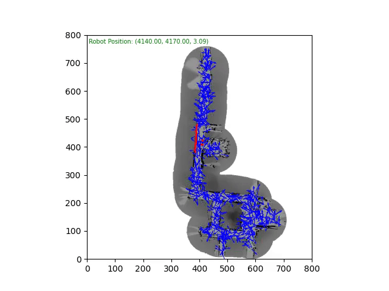
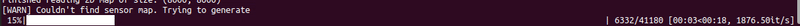
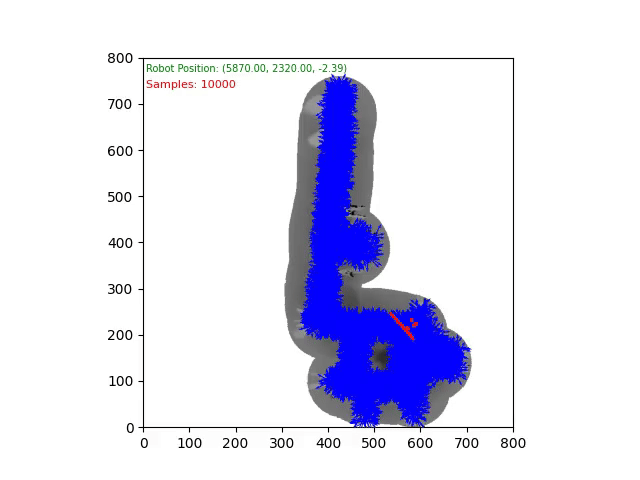
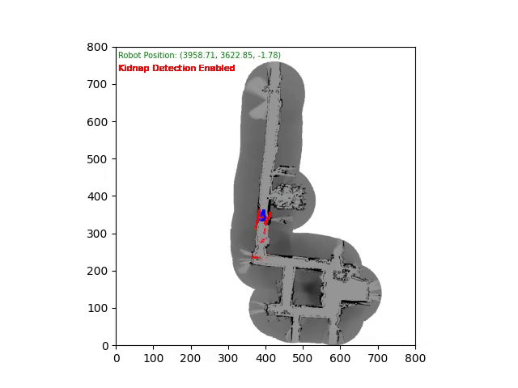

# Robot Localization using Monte Carlo Localization

## Overview

This project implements global localization using a particle filter (Monte Carlo Localization) for an indoor robot operating with odometry and a laser rangefinder on a pre-built 2D map. The system runs at 40Hz on an 80x80m map.

##### Result Data Log2



### Key Components

#### Motion Model

Each particle's pose is updated using the **odometry motion model** as defined in Chapter 5 of [1]. The proposal distribution is derived from the robot's odometry and control input:
\[ p(x_t^m | u_t, x_{t-1}^m) \]

#### Sensor Model

The laser beam measurement model is implemented as described in Section 6.3 of [1]. The model, \( p(z_t | x_t, m) \), is a mixture of four probability densities, each accounting for a specific type of measurement error:

1. **Hit Model (p_hit)** Represents accurate measurements that align with the expected range based on the map.
2. **Short Model (p_short)**: Captures unexpected short-range readings caused by obstacles closer than expected.
3. **Max Model (p_max)**: Accounts for max-range readings when no obstacle is detected within the laser's range.
4. **Random Model (p_rand)**: Models random noise in the measurements.

The overall probability \( p(z_t | x_t, m) \) is a weighted sum of these components, ensuring robust handling of various measurement scenarios.

#### Resampling

Particles for the next time step are sampled based on their weights from the current time step using a **low-variance resampling** technique. This minimizes the variance in particle filtering and improves the estimator of the robot's true belief.


---

## Features

- **()Preprocessed Ray Map**: GPU-accelerated ray-casting on the unoccupied map space, performed once during initialization for efficiency.
  Remark: It takes less than 30sec to generate the map (80x80m^2)

  
- **Adaptive Particle Count**: Dynamically adjusts the number of particles based on the variance of particle weights. Enable with `--adaptive`.

  
- **Robot Kidnapping Detection**: Detects robot kidnapping events using the mean-to-max weight ratio. Enable with `--detect_kidnap`.

  

---

## Running the Code

Navigate to the code directory and execute the following command:

```bash
cd code/
python3 main.py --visualize
```

### Useful Arguments

* **Enable Visualization** : `--visualize`
* **Set Number of Particles** : `--num_particles=<value>`
* **Path to Log File** : `--path_to_log=<path>`
* **Enable Adaptive Sampling** : `--adaptive`
* **Enable Robot Kidnap Detection** : `--detect_kidnap`


[1]: Probabilistic Robotics, by Sebastian Thrun, Wolfram Burgard, and Dieter Fox.
